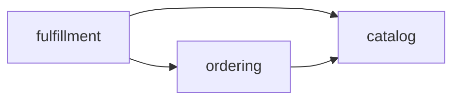
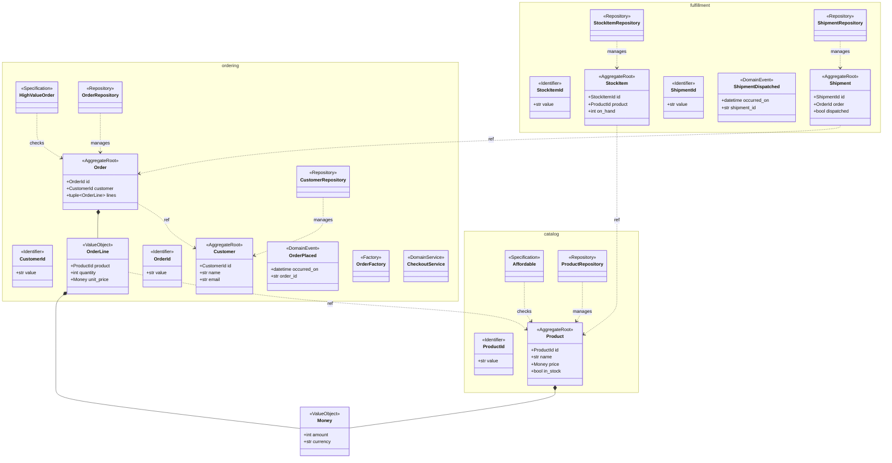
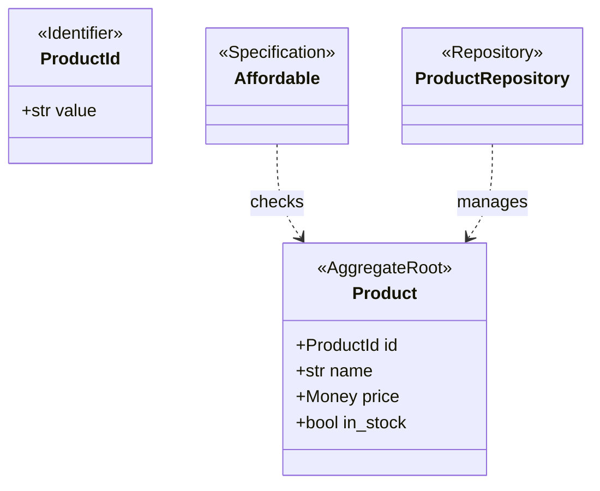
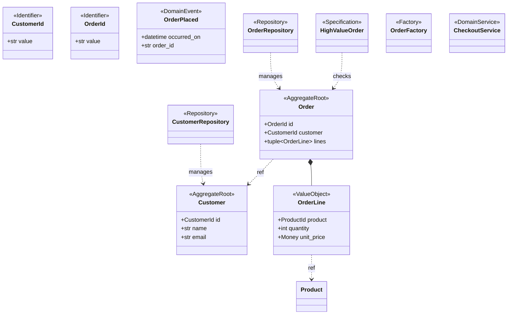
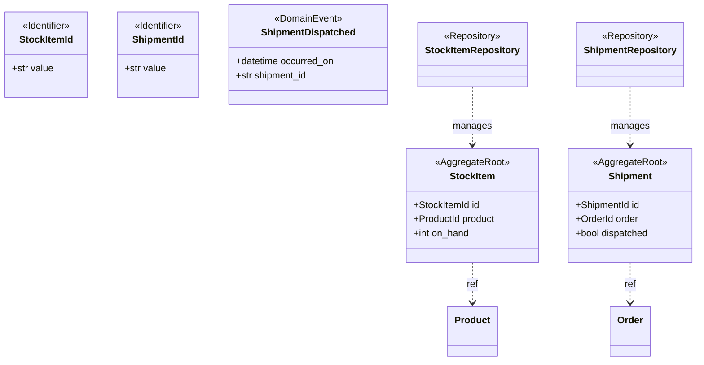

# Shop domain diagram

Generated by `python -m examples.shop.diagram --write`. Do not edit by hand.

## Context map

```mermaid
graph LR
  catalog["catalog"]
  fulfillment["fulfillment"]
  ordering["ordering"]
  fulfillment --> catalog
  fulfillment --> ordering
  ordering --> catalog
```

## Overview (all contexts)

```mermaid
classDiagram
class Money {
  <<ValueObject>>
  +int amount
  +str currency
}
namespace catalog {
  class ProductId {
    <<Identifier>>
    +str value
  }
  class Product {
    <<AggregateRoot>>
    +ProductId id
    +str name
    +Money price
    +bool in_stock
  }
  class Affordable {
    <<Specification>>
  }
  class ProductRepository {
    <<Repository>>
  }
}
namespace ordering {
  class CustomerId {
    <<Identifier>>
    +str value
  }
  class Customer {
    <<AggregateRoot>>
    +CustomerId id
    +str name
    +str email
  }
  class OrderId {
    <<Identifier>>
    +str value
  }
  class OrderLine {
    <<ValueObject>>
    +ProductId product
    +int quantity
    +Money unit_price
  }
  class OrderPlaced {
    <<DomainEvent>>
    +datetime occurred_on
    +str order_id
  }
  class Order {
    <<AggregateRoot>>
    +OrderId id
    +CustomerId customer
    +tuple~OrderLine~ lines
  }
  class HighValueOrder {
    <<Specification>>
  }
  class OrderRepository {
    <<Repository>>
  }
  class CustomerRepository {
    <<Repository>>
  }
  class OrderFactory {
    <<Factory>>
  }
  class CheckoutService {
    <<DomainService>>
  }
}
namespace fulfillment {
  class StockItemId {
    <<Identifier>>
    +str value
  }
  class StockItem {
    <<AggregateRoot>>
    +StockItemId id
    +ProductId product
    +int on_hand
  }
  class ShipmentId {
    <<Identifier>>
    +str value
  }
  class ShipmentDispatched {
    <<DomainEvent>>
    +datetime occurred_on
    +str shipment_id
  }
  class Shipment {
    <<AggregateRoot>>
    +ShipmentId id
    +OrderId order
    +bool dispatched
  }
  class StockItemRepository {
    <<Repository>>
  }
  class ShipmentRepository {
    <<Repository>>
  }
}
Product *-- Money
Affordable ..> Product : checks
ProductRepository ..> Product : manages
OrderLine ..> Product : ref
OrderLine *-- Money
Order ..> Customer : ref
Order *-- OrderLine
HighValueOrder ..> Order : checks
OrderRepository ..> Order : manages
CustomerRepository ..> Customer : manages
StockItem ..> Product : ref
Shipment ..> Order : ref
StockItemRepository ..> StockItem : manages
ShipmentRepository ..> Shipment : manages
```

## catalog

```mermaid
classDiagram
class ProductId {
  <<Identifier>>
  +str value
}
class Product {
  <<AggregateRoot>>
  +ProductId id
  +str name
  +Money price
  +bool in_stock
}
class Affordable {
  <<Specification>>
}
class ProductRepository {
  <<Repository>>
}
Affordable ..> Product : checks
ProductRepository ..> Product : manages
```

## ordering

```mermaid
classDiagram
class CustomerId {
  <<Identifier>>
  +str value
}
class Customer {
  <<AggregateRoot>>
  +CustomerId id
  +str name
  +str email
}
class OrderId {
  <<Identifier>>
  +str value
}
class OrderLine {
  <<ValueObject>>
  +ProductId product
  +int quantity
  +Money unit_price
}
class OrderPlaced {
  <<DomainEvent>>
  +datetime occurred_on
  +str order_id
}
class Order {
  <<AggregateRoot>>
  +OrderId id
  +CustomerId customer
  +tuple~OrderLine~ lines
}
class HighValueOrder {
  <<Specification>>
}
class OrderRepository {
  <<Repository>>
}
class CustomerRepository {
  <<Repository>>
}
class OrderFactory {
  <<Factory>>
}
class CheckoutService {
  <<DomainService>>
}
OrderLine ..> Product : ref
Order ..> Customer : ref
Order *-- OrderLine
HighValueOrder ..> Order : checks
OrderRepository ..> Order : manages
CustomerRepository ..> Customer : manages
```

## fulfillment

```mermaid
classDiagram
class StockItemId {
  <<Identifier>>
  +str value
}
class StockItem {
  <<AggregateRoot>>
  +StockItemId id
  +ProductId product
  +int on_hand
}
class ShipmentId {
  <<Identifier>>
  +str value
}
class ShipmentDispatched {
  <<DomainEvent>>
  +datetime occurred_on
  +str shipment_id
}
class Shipment {
  <<AggregateRoot>>
  +ShipmentId id
  +OrderId order
  +bool dispatched
}
class StockItemRepository {
  <<Repository>>
}
class ShipmentRepository {
  <<Repository>>
}
StockItem ..> Product : ref
Shipment ..> Order : ref
StockItemRepository ..> StockItem : manages
ShipmentRepository ..> Shipment : manages
```
